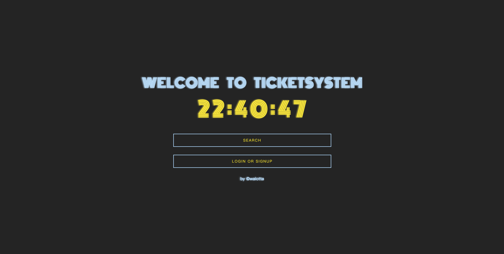
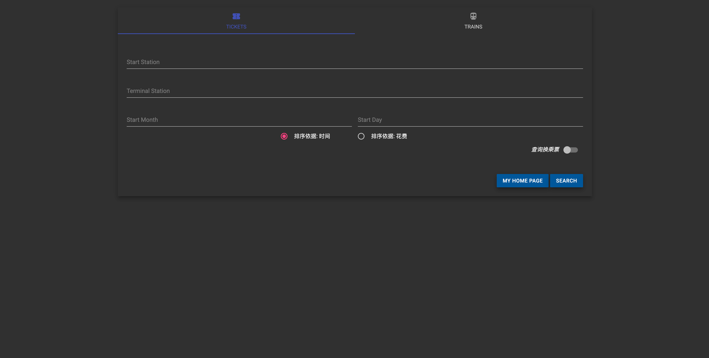
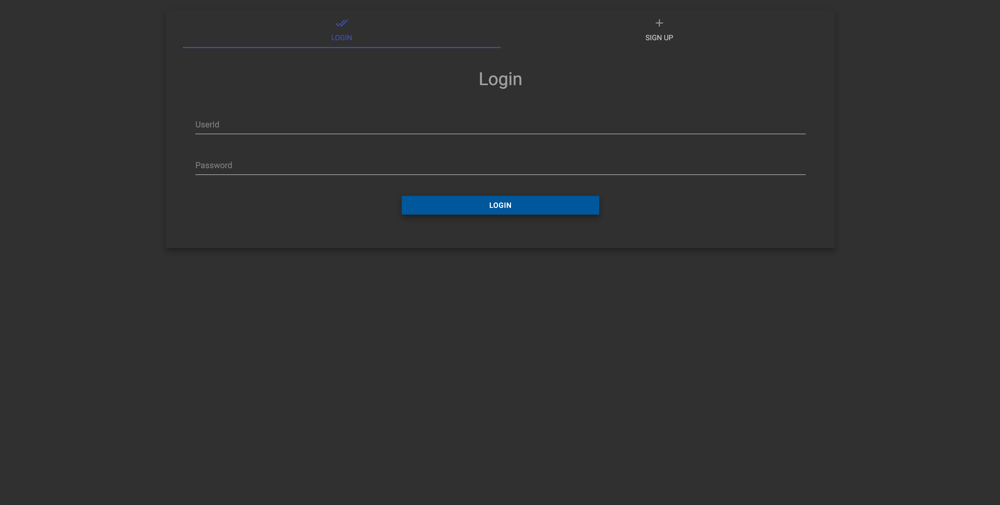
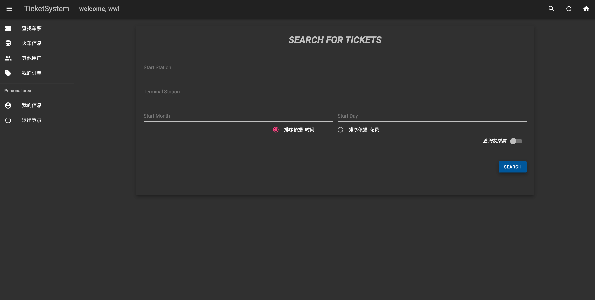
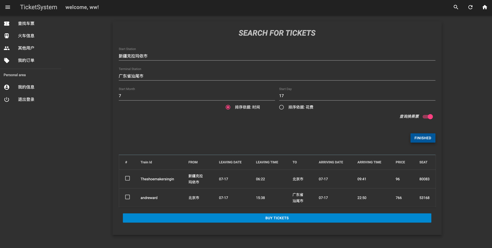
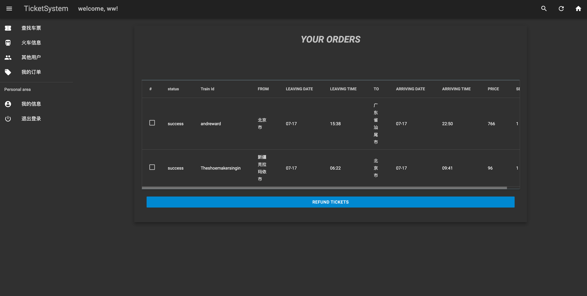
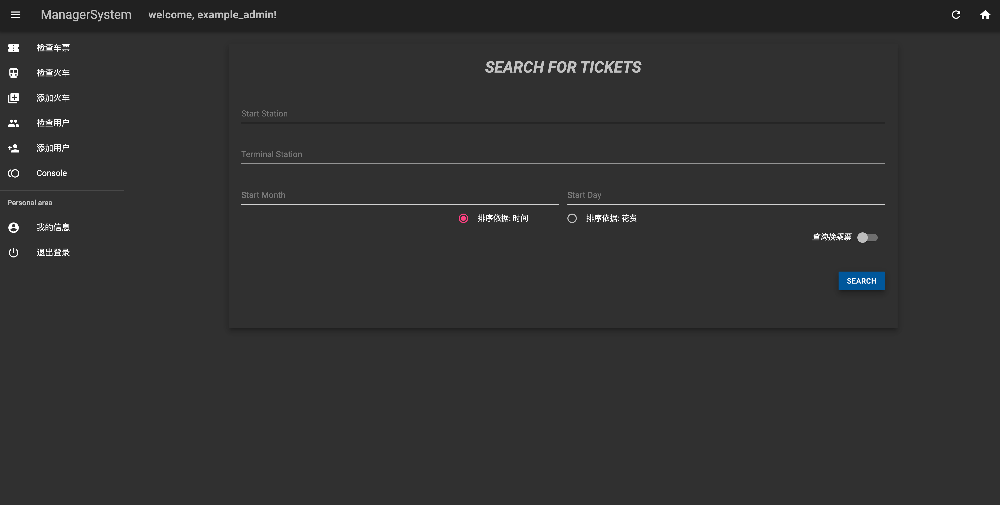
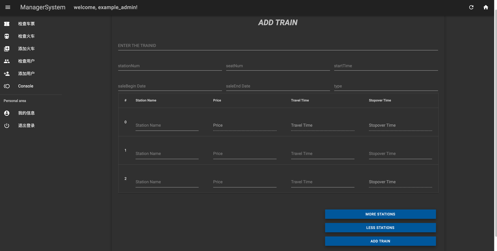
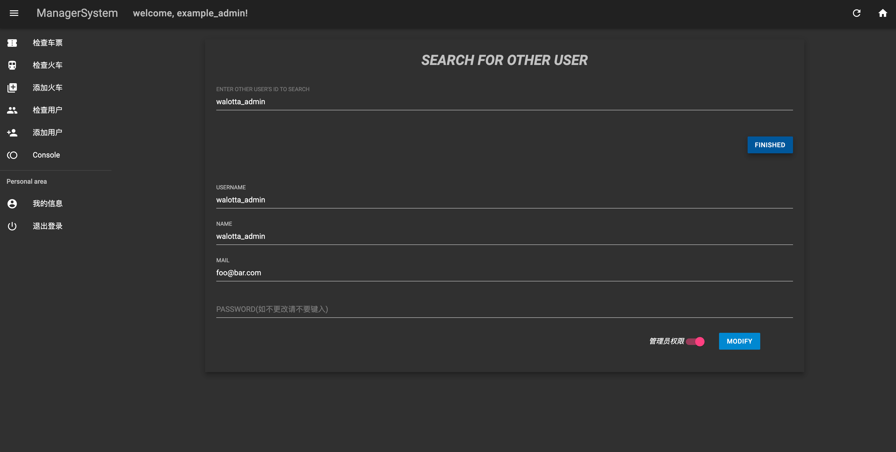
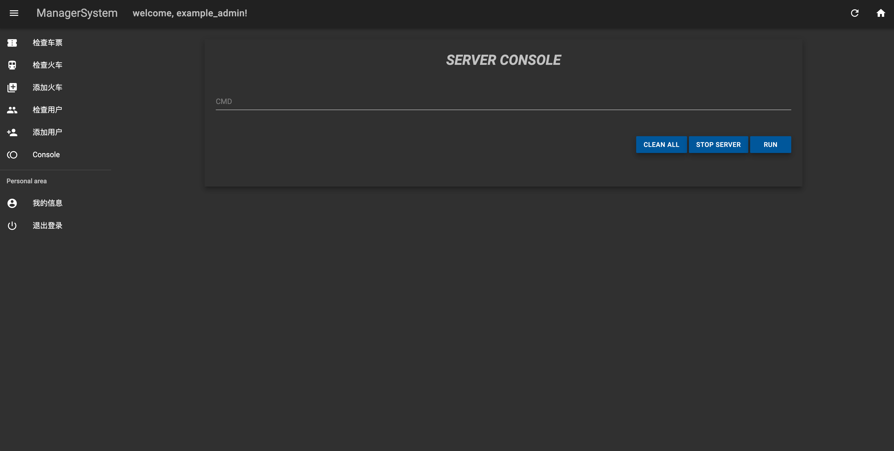

# TicketSystem 使用指北

## 1、安装指北

### 	部署

#### 环境部署

本系统使用了基于`web` 的架构，主要使用了nginx进行端口与文件分发服务，使用php进行逻辑与字符串处理并负责与后端通讯，使用mdui的系列主题，在html模版上使用js进行网页动态渲染。因此，要部署的环境有nginx与php

##### `nginx`服务配置

```bash
server
{
  listen 80 ;
  server_name ticket.walotta.top;
  root /home/ubuntu/TicketSystem-2021/front;
  index /html/index.html;

  fastcgi_intercept_errors on;
  error_page 404 http://error.walotta.top;

  location ~ \.php$ {
    #root /home/ubuntu/Program_bookstore/web/;
    try_files $uri =404;

  include fastcgi.conf;
   fastcgi_pass Unix:/run/php/php7.4-fpm.sock;
  }

}
```

##### `PHP`服务配置

```bash
sudo apt install php-fpm
service php-fpm start
```

#### `web`内容部署

##### 网页数据部署

下载`github`项目并部署在/home/ubuntu，赋予chmod 777权限即可

此时，网页服务已在运行

#### 开启服务

```bash
cd std_code
./socked_code
```

同时，也可以使用`cin_code`来进行大量指令导入数据，初始化管理员将由系统完成，如为第一次启用系统，请使用`cin`命令行添加第一位管理员，普通管理员权限应当设置为5

## 2、普通用户使用指北

### 进入系统

- 访问网址`ticket.walotta.top`

- 

- 此时可以进入搜索页面，但是不能进行票的操作，只能进行查询

- 

- 选择登陆或者注册，如果此时以及处于登陆状态，则会直接跳转到个人页面，若未登陆，可以选择登陆或者注册，注册时注意`userId`不能与其他用户重复

- 

  

### 执行操作

- 登陆后进入个人管理页面
- 
- 此时可以进行查票(换乘或非换乘)，在查询后可以购买
- 
- 也可以进行火车信息的查询
- 退票操作则在订单页面中操作
- 
- 具体内容在网页内有详尽的指引

## 3、管理员使用指北

### 管理员简介

管理员账号时内部员工使用的账户，没有普通用户的购票退票操作，用于添加其他的管理员，发布、增加火车

### 进入页面

只要登陆管理员账户即可



### 进行管理

- 管理员可以进行查车票的功能，但是不能购票

- 管理员可以查询火车，并对其进行发布或删除

- 管理员可以添加火车

- 

  可以增加行数或减少行数，填写信息时不需要全部填入，可以留有空行，网页采用动态渲染，增加行数不会导致填写信息消失

- 管理员可以在检查用户界面更改其他用户的信息

- 

- 也可以在添加用户界面添加一个新的用户(默认为管理员)

- 管理员可以在`console`界面执行指令，用于大量添加火车或者进行服务器管理

- 


## 感谢使用该系统

